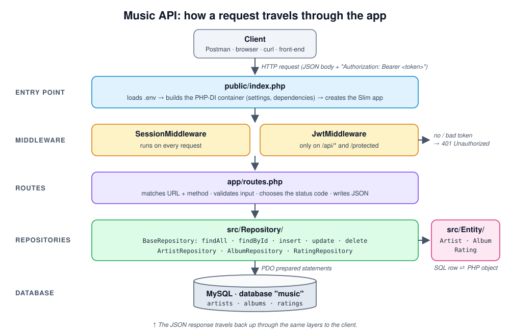
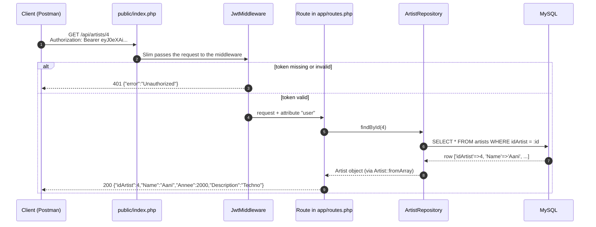
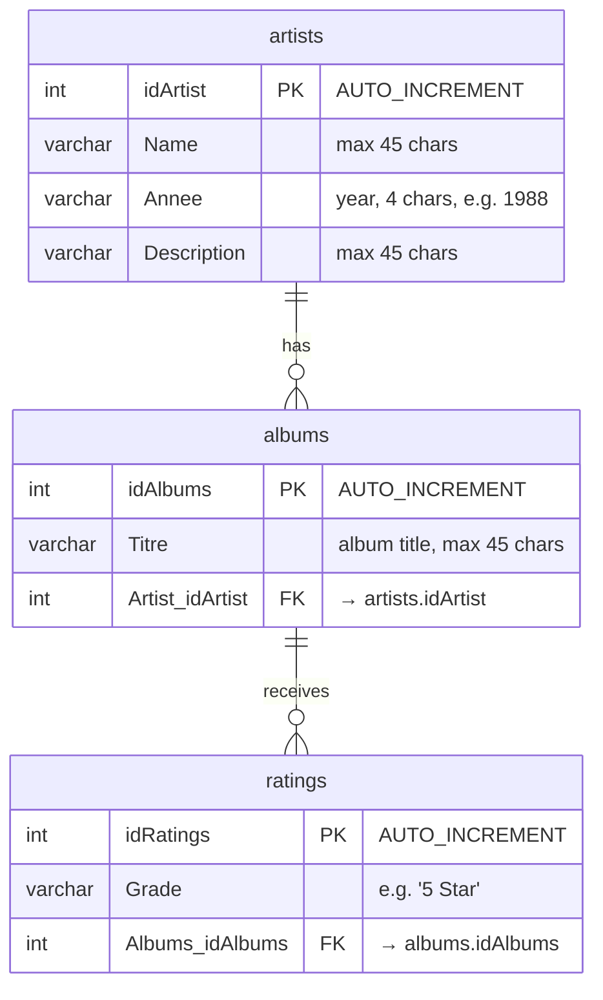
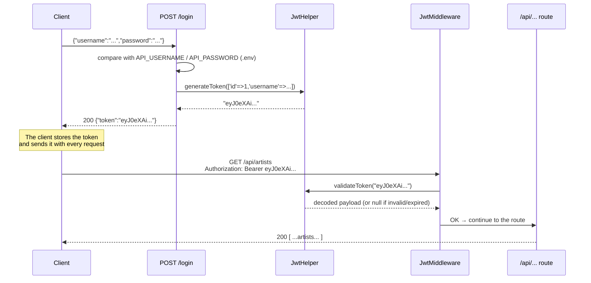
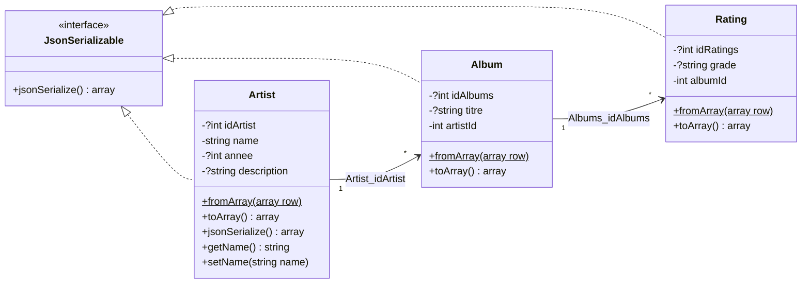
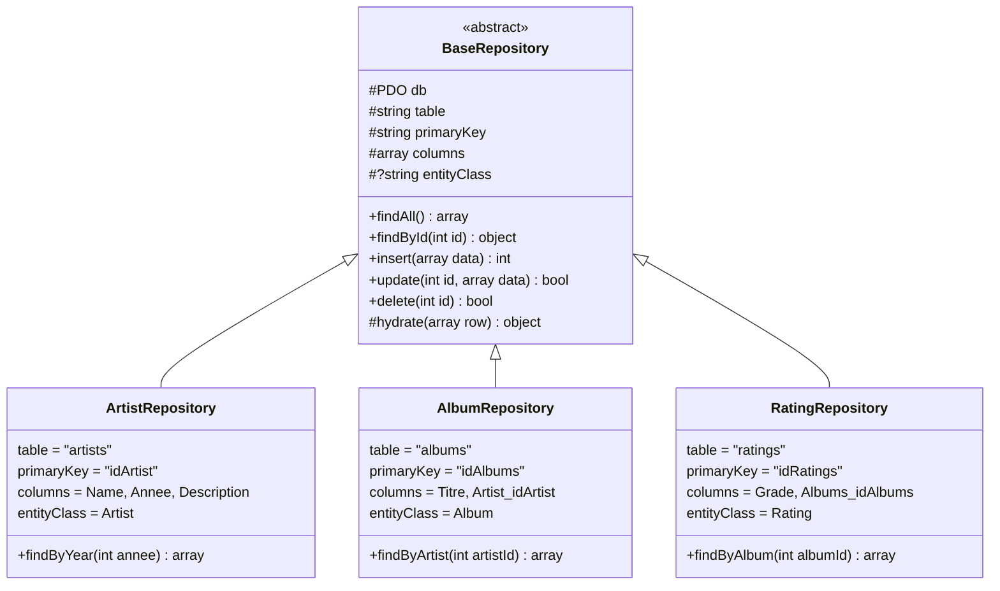
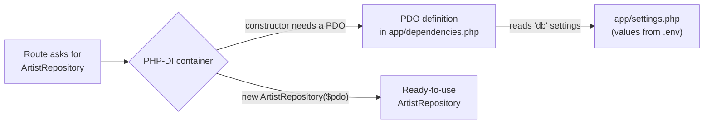

# 🎵 Music API: a REST API with PHP Slim 4

A small but complete **REST API** for managing **artists**, their **albums**, and **ratings** of those albums.
It is built with the **Slim 4** PHP micro-framework, a **MySQL** database, and **JWT** authentication.

This project is meant for **learning**. By reading this README and the code, you will understand:

- how an HTTP request travels through a PHP web application,
- what **routes**, **middleware**, **repositories**, and **entities** are, and why we separate them,
- how **JWT tokens** protect an API,
- how to talk to a database safely with **PDO prepared statements**,
- how to keep secrets (passwords, keys) **out of Git** with a `.env` file.

---

## 📚 Table of contents

1. [Tech stack](#-tech-stack)
2. [Architecture](#-architecture)
3. [Project structure](#-project-structure)
4. [Database](#-database)
5. [Getting started](#-getting-started)
6. [Authentication (JWT)](#-authentication-jwt)
7. [API endpoints](#-api-endpoints)
8. [Entities](#-entities)
9. [Repositories](#-repositories)
10. [Dependency injection (PHP-DI)](#-dependency-injection-php-di)
11. [HTTP status codes used](#-http-status-codes-used)
12. [Tutorial: add a new resource](#-tutorial-add-a-new-resource)
13. [Known limitations & exercises](#-known-limitations--exercises)
14. [Tests & code quality](#-tests--code-quality)
15. [Troubleshooting](#-troubleshooting)

---

## 🧰 Tech stack

| Tool | Role in this project |
|---|---|
| **PHP 8.0+** | The programming language |
| **[Slim 4](https://www.slimframework.com/)** | Micro-framework: receives HTTP requests and sends them to the right route |
| **[PHP-DI](https://php-di.org/)** | Dependency-injection container: creates objects (like the database connection) for us |
| **PDO + MySQL** | Database access (MAMP on Mac, WAMP on Windows) |
| **[firebase/php-jwt](https://github.com/firebase/php-jwt)** | Creates and checks JWT tokens |
| **[vlucas/phpdotenv](https://github.com/vlucas/phpdotenv)** | Reads secrets from the `.env` file |
| **Monolog** | Logging |
| **Composer** | PHP package manager (installs everything above into `vendor/`) |
| **PHPUnit** | Automated tests |

---

## 🏗 Architecture



The application is split into **layers**. Each layer has **one job** and only talks to the layer just below it:

| Layer | Folder / file | Its job | It must **not**… |
|---|---|---|---|
| **Entry point** | `public/index.php` | Starts everything: loads `.env`, builds the container, registers middleware and routes | contain business logic |
| **Middleware** | `src/Middleware/`, `src/Application/Middleware/` | Code that runs **before** the route (e.g. "is the token valid?") | know about artists or albums |
| **Routes** | `app/routes.php` | Read the request, validate input, call a repository, return JSON with the right status code | write SQL |
| **Repositories** | `src/Repository/` | All the SQL lives here (SELECT, INSERT, UPDATE, DELETE) | know about HTTP, requests, or responses |
| **Entities** | `src/Entity/` | PHP objects that represent one row of a table | talk to the database |
| **Database** | MySQL `music` | Stores the data | |

> 💡 **Why separate?** If tomorrow you switch from MySQL to PostgreSQL, you only change the repositories.
> If you change the URL of an endpoint, you only change `routes.php`. Each change stays in **one place**.

### The life of a request

Here is what happens when a client asks for artist #4:



---

## 📁 Project structure

```text
music-api/
├── app/                        ← Configuration of the Slim application
│   ├── settings.php            ← Settings (database, logger, error display). Reads values from .env
│   ├── dependencies.php        ← Tells PHP-DI how to build PDO (DB connection) and the Logger
│   ├── repositories.php        ← Binds interfaces to classes (used by the demo /users routes)
│   ├── middleware.php          ← Global middleware (SessionMiddleware)
│   └── routes.php              ← ⭐ ALL the API endpoints are defined here
│
├── database/
│   └── music.sql               ← ⭐ Script that creates the database + sample data
│
├── docs/images/                ← Images used by this README
│
├── public/                     ← The ONLY folder exposed to the web
│   ├── index.php               ← ⭐ Entry point: every request starts here
│   └── .htaccess               ← Apache: sends every URL to index.php
│
├── src/                        ← Our PHP classes (namespace App\)
│   ├── Entity/                 ← ⭐ Artist, Album, Rating (one object = one table row)
│   ├── Repository/             ← ⭐ BaseRepository + one repository per table (SQL lives here)
│   ├── Middleware/             ← ⭐ JwtHelper (create/check tokens) + JwtMiddleware (protect routes)
│   ├── Application/            ← Code from the Slim skeleton: error handlers, Actions, Settings
│   ├── Domain/                 ← Slim skeleton demo: User model
│   └── Infrastructure/         ← Slim skeleton demo: in-memory User repository
│
├── tests/                      ← PHPUnit tests (for the skeleton's /users demo)
├── vendor/                     ← Libraries installed by Composer (NOT in Git)
├── logs/                       ← Log files (NOT in Git)
│
├── .env                        ← 🔒 Your secrets (NOT in Git, you create it)
├── .env.example                ← Template showing which variables .env needs
├── composer.json               ← List of PHP dependencies + scripts (composer start, composer test)
└── composer.lock               ← Exact versions installed (keep it in Git)
```

> ⭐ = the files you should read first.
> `Application/`, `Domain/` and `Infrastructure/` come from the official **Slim Skeleton** template.
> They show another way to organise code ("Actions" classes) and power the demo `/users` routes.

---

## 🗄 Database

The database is called **`music`** and has **3 tables** linked by **foreign keys**:



How to read this diagram:

- **One artist** has **zero or many albums** (`||--o{`).
- **One album** has **zero or many ratings**.
- `Artist_idArtist` in `albums` is a **foreign key**: it must contain the id of an artist that **exists**.
  MySQL refuses an album pointing to a non-existent artist, and also refuses to delete an artist who still has albums.

The full script (tables + sample data) is in [`database/music.sql`](database/music.sql).

---

## 🚀 Getting started

### 1. Prerequisites

- **PHP 8.0 or newer**. Check with `php -v`.
- **Composer**. Check with `composer -V` ([install guide](https://getcomposer.org/download/)).
- **MySQL**: the easiest is **MAMP** (Mac) or **WAMP** (Windows).
- **Postman** (or curl) to test the API.

### 2. Clone the project and install the libraries

```bash
git clone https://github.com/Venki-Sub/MusicAPI.git
cd MusicAPI
composer install
```

`composer install` reads `composer.lock` and downloads every library into `vendor/`.

### 3. Create the database

1. Start **MAMP** (or WAMP).
2. Open **phpMyAdmin** → **Import** tab → choose `database/music.sql` → **Go**.

Or from a terminal:

```bash
mysql -h 127.0.0.1 -P 8889 -u root -p < database/music.sql    # MAMP (password: root)
mysql -h 127.0.0.1 -P 3306 -u root    < database/music.sql    # WAMP (no password)
```

### 4. Create your `.env` file

```bash
cp .env.example .env
```

Then open `.env` and fill in the values:

| Variable | Meaning | MAMP | WAMP |
|---|---|---|---|
| `JWT_SECRET` | Secret key used to sign tokens. **At least 32 characters.** Generate one with `openssl rand -hex 32` | *(random)* | *(random)* |
| `DB_HOST` | MySQL server address | `127.0.0.1` | `127.0.0.1` |
| `DB_PORT` | MySQL port | `8889` | `3306` |
| `DB_NAME` | Database name | `music` | `music` |
| `DB_USER` | MySQL user | `root` | `root` |
| `DB_PASS` | MySQL password | `root` | *(empty)* |
| `API_USERNAME` | Username accepted by `POST /login` | *(your choice)* | *(your choice)* |
| `API_PASSWORD` | Password accepted by `POST /login` | *(your choice)* | *(your choice)* |

> 🔒 **Why a `.env` file?** Secrets must **never** be committed to Git: anyone who can read the repository
> could read them, and they stay in the Git history forever. `.env` is listed in `.gitignore`, so Git ignores it.
> `.env.example` (with empty values) **is** committed, so others know which variables to create.

### 5. Start the server

```bash
composer start
```

This runs PHP's built-in server: `php -S localhost:8080 -t public`.
Open <http://localhost:8080>. You should see **Hello world!** 🎉

---

## 🔐 Authentication (JWT)

Most endpoints are **protected**: you need a **token** to call them.

### What is a JWT?

A **JSON Web Token** is a string made of 3 parts separated by dots: `header.payload.signature`.

```text
eyJ0eXAiOiJKV1QiLCJhbGciOiJIUzI1NiJ9 . eyJpYXQiOjE3OTEy...fQ . 8xH3k...
└───────────── header ──────────────┘   └─── payload ───┘   └─ signature ─┘
   {"typ":"JWT","alg":"HS256"}           {"iat":..., "exp":...,   HMAC-SHA256(header.payload,
                                          "data":{"id":1,           JWT_SECRET)
                                                  "username":"..."}}
```

- The **payload** is only Base64-encoded, **not encrypted**: anyone can read it. Never put a password in it!
- The **signature** is computed with `JWT_SECRET`. Only our server knows the secret, so only our server can create
  a valid signature. If someone changes the payload, the signature no longer matches and the token is rejected.
- The token **expires** after 1 hour (`exp` field, see `JwtHelper::generateToken()`).

### The flow



### The code

| File | What it does |
|---|---|
| [`src/Middleware/JwtHelper.php`](src/Middleware/JwtHelper.php) | `generateToken()` creates a signed token. `validateToken()` checks the signature + expiry and returns the payload, or `null` |
| [`src/Middleware/JwtMiddleware.php`](src/Middleware/JwtMiddleware.php) | Reads the `Authorization: Bearer <token>` header. Valid → continues and stores the user in the request attribute `user`. Invalid → stops and returns **401** |
| [`app/routes.php`](app/routes.php) | `POST /login` creates the token. `->add(new JwtMiddleware())` protects a route or a whole group |

### Try it with Postman

1. `POST http://localhost:8080/login` → **Body** → **raw** → **JSON**:
   ```json
   { "username": "your API_USERNAME", "password": "your API_PASSWORD" }
   ```
2. Copy the `token` from the response.
3. On any `/api/...` request → **Authorization** tab → Type **Bearer Token** → paste the token.

### Try it with curl

```bash
# 1. Log in and keep the token in a variable
TOKEN=$(curl -s -X POST http://localhost:8080/login \
  -H "Content-Type: application/json" \
  -d '{"username":"YOUR_USER","password":"YOUR_PASS"}' | php -r 'echo json_decode(stream_get_contents(STDIN))->token;')

# 2. Use the token
curl -H "Authorization: Bearer $TOKEN" http://localhost:8080/api/artists
```

---

## 📡 API endpoints

All `/api/...` endpoints need the header `Authorization: Bearer <token>`.
Request bodies can be sent as **JSON** (`Content-Type: application/json`) or as a **form** (`x-www-form-urlencoded`).
Responses are always **JSON**.

### Overview

| Method | URL | 🔒 | Description | Success |
|---|---|:-:|---|:-:|
| `GET` | `/` | | Hello world (checks that the server runs) | 200 |
| `POST` | `/login` | | Get a JWT token | 200 |
| `GET` | `/protected` | 🔒 | Test route: says hello to the logged-in user | 200 |
| **Artists** | | | | |
| `GET` | `/api/artists` | 🔒 | List all artists | 200 |
| `GET` | `/api/artists/{id}` | 🔒 | One artist | 200 / 404 |
| `GET` | `/api/artists/year/{annee}` | 🔒 | Artists from a given year | 200 |
| `GET` | `/api/artists/{id}/albums` | 🔒 | Albums of an artist | 200 |
| `POST` | `/api/artists` | 🔒 | Create an artist | 201 / 400 |
| `PUT` | `/api/artists/{id}` | 🔒 | Update an artist | 200 / 404 |
| `DELETE` | `/api/artists/{id}` | 🔒 | Delete an artist | 204 / 404 |
| **Albums** | | | | |
| `GET` | `/api/albums` | 🔒 | List all albums | 200 |
| `GET` | `/api/albums/{id}` | 🔒 | One album | 200 / 404 |
| `GET` | `/api/albums/{id}/ratings` | 🔒 | Ratings of an album | 200 |
| `POST` | `/api/albums` | 🔒 | Create an album | 201 / 400 |
| `PUT` | `/api/albums/{id}` | 🔒 | Update an album | 200 / 400 / 404 |
| `DELETE` | `/api/albums/{id}` | 🔒 | Delete an album | 204 / 404 |
| **Ratings** | | | | |
| `GET` | `/api/ratings` | 🔒 | List all ratings | 200 |
| `GET` | `/api/ratings/{id}` | 🔒 | One rating | 200 / 404 |
| `POST` | `/api/ratings` | 🔒 | Create a rating | 201 / 400 |
| `PUT` | `/api/ratings/{id}` | 🔒 | Update a rating | 200 / 400 / 404 |
| `DELETE` | `/api/ratings/{id}` | 🔒 | Delete a rating | 204 / 404 |
| **Demo / test routes** | | | | |
| `GET` | `/GetAllArtist` | | First DB test, raw SQL in the route (⚠️ not protected) | 200 |
| `GET` | `/users`, `/users/{id}` | | Slim skeleton demo, fake users stored in memory | 200 / 404 |

> 💡 **Route order:** `/api/artists/year/{annee}` is declared **before** `/api/artists/{id}`. Here they cannot collide
> (3 segments vs 2), but when two routes with `{placeholders}` *can* match the same URL, the one declared **first** wins.
> So declare the most specific routes first.

### Auth

#### `POST /login`

```json
// Request body
{ "username": "SaintMichel", "password": "••••••" }

// 200 OK
{ "token": "eyJ0eXAiOiJKV1QiLCJhbGciOiJIUzI1NiJ9.eyJpYXQiOjE3OTEy..." }

// 401 Unauthorized
{ "error": "Invalid credentials" }
```

#### `GET /protected` 🔒

```json
// 200 OK
{ "message": "Hello, SaintMichel" }
```

### Artists

Fields: `idArtist` (auto), `Name` (**required** on create), `Annee`, `Description`.

#### `GET /api/artists/{id}` 🔒

```json
// GET /api/artists/4  →  200 OK
{ "idArtist": 4, "Name": "Aani", "Annee": 2000, "Description": "Techno" }

// GET /api/artists/999  →  404 Not Found
{ "error": "Artiste introuvable" }
```

#### `GET /api/artists/year/{annee}` 🔒

```json
// GET /api/artists/year/1988  →  200 OK
[
  { "idArtist": 5,  "Name": "Venki", "Annee": 1988, "Description": "rock" },
  { "idArtist": 9,  "Name": "Will",  "Annee": 1988, "Description": "All is well" },
  { "idArtist": 11, "Name": "Joyce", "Annee": 1988, "Description": "Love" }
]
```

#### `GET /api/artists/{id}/albums` 🔒

```json
// GET /api/artists/4/albums  →  200 OK
[
  { "idAlbums": 5, "Titre": "SoloSun", "Artist_idArtist": 4 },
  { "idAlbums": 6, "Titre": "Sunrise", "Artist_idArtist": 4 }
]
```

#### `POST /api/artists` 🔒

```json
// Request body
{ "Name": "Daft Punk", "Annee": "1993", "Description": "French house" }

// 201 Created: returns the new id
{ "idArtist": 14 }

// 400 Bad Request: Name is missing
{ "error": "Le champ Name est obligatoire" }
```

#### `PUT /api/artists/{id}` 🔒

Send **only the fields you want to change**. Returns the updated artist.

```json
// PUT /api/artists/14   body: { "Description": "Electronic duo" }
// 200 OK
{ "idArtist": 14, "Name": "Daft Punk", "Annee": 1993, "Description": "Electronic duo" }
```

#### `DELETE /api/artists/{id}` 🔒

`204 No Content` (empty body) if deleted, `404` if the artist does not exist.

> ⚠️ An artist who **still has albums** cannot be deleted (foreign key). See [exercises](#-known-limitations--exercises).

### Albums

Fields: `idAlbums` (auto), `Titre` (**required**), `Artist_idArtist` (**required**, must be an existing artist).

```json
// POST /api/albums   body: { "Titre": "Discovery", "Artist_idArtist": 14 }
// 201 Created
{ "idAlbums": 12 }

// 400: missing fields
{ "error": "Les champs Titre et Artist_idArtist sont obligatoires" }

// 400: the artist does not exist
{ "error": "Artiste introuvable" }
```

```json
// GET /api/albums/7/ratings  →  200 OK
[ { "idRatings": 5, "Grade": "5 Star", "Albums_idAlbums": 7 } ]
```

`GET`, `PUT` and `DELETE` work like the artist endpoints (404 message: `"Album introuvable"`).
On `PUT`, if you change `Artist_idArtist`, the new artist must exist, otherwise you get a **400**.

### Ratings

Fields: `idRatings` (auto), `Grade` (**required**, text, e.g. `"5 Star"`), `Albums_idAlbums` (**required**, must be an existing album).

```json
// POST /api/ratings   body: { "Grade": "4 Star", "Albums_idAlbums": 7 }
// 201 Created
{ "idRatings": 11 }

// GET /api/ratings/5  →  200 OK
{ "idRatings": 5, "Grade": "5 Star", "Albums_idAlbums": 7 }
```

`GET`, `PUT` and `DELETE` work like the artist endpoints (404 message: `"Note introuvable"`).

---

## 🧩 Entities

An **entity** is a PHP class that represents **one row** of a table. Instead of handling arrays like
`$row['Name']`, we handle objects like `$artist->getName()`. Typing mistakes are caught earlier, and the code is easier to read.



Every entity has the same 3 important methods (see [`src/Entity/Artist.php`](src/Entity/Artist.php)):

| Method | Direction | Used when |
|---|---|---|
| `fromArray(array $row)` *(static, underlined in the diagram)* | SQL row (array) ➜ object | The repository reads from the database |
| `toArray()` | object ➜ array (column names) | We need the column names back |
| `jsonSerialize()` | object ➜ JSON | Called **automatically** by `json_encode($artist)` |

```php
$row    = ['idArtist' => '4', 'Name' => 'Aani', 'Annee' => '2000', 'Description' => 'Techno'];
$artist = Artist::fromArray($row);   // strings from MySQL become typed values (int)
echo $artist->getName();             // Aani
echo json_encode($artist);           // {"idArtist":4,"Name":"Aani","Annee":2000,"Description":"Techno"}
```

---

## 🗃 Repositories

A **repository** is the **only place where SQL is written**. The routes never write SQL; they ask the repository.



### `BaseRepository`: write the CRUD once, reuse it 3 times

[`src/Repository/BaseRepository.php`](src/Repository/BaseRepository.php) is an **abstract class**: it cannot be used
directly, only **extended**. It contains the 5 CRUD methods, written in a **generic** way using 4 properties:

| Property | Example (artists) | Used for |
|---|---|---|
| `$table` | `'artists'` | `SELECT * FROM artists` |
| `$primaryKey` | `'idArtist'` | `WHERE idArtist = :id` |
| `$columns` | `['Name', 'Annee', 'Description']` | **whitelist** of columns allowed in INSERT / UPDATE |
| `$entityClass` | `Artist::class` | converts each row into an `Artist` object (`hydrate()`) |

A child repository only **declares these 4 values** and inherits the whole CRUD. It then adds its **specific** methods
(`findByYear`, `findByArtist`, `findByAlbum`).

| Method | SQL generated (artists) | Returns |
|---|---|---|
| `findAll()` | `SELECT * FROM artists` | array of `Artist` |
| `findById(4)` | `SELECT * FROM artists WHERE idArtist = :id` | `Artist` or `null` |
| `insert(['Name'=>'X'])` | `INSERT INTO artists (Name) VALUES (:Name)` | the new id (`int`) |
| `update(4, ['Name'=>'Y'])` | `UPDATE artists SET Name = :Name WHERE idArtist = :id` | `bool` |
| `delete(4)` | `DELETE FROM artists WHERE idArtist = :id` | `true` if a row was deleted |

### 🛡 Two security rules used everywhere

1. **Prepared statements** (`:id`, `:Name`…). The values are sent **separately** from the SQL, so a user
   cannot inject SQL code (**SQL injection**):
   ```php
   // ❌ NEVER: the user controls the SQL
   $db->query("SELECT * FROM artists WHERE idArtist = " . $_GET['id']);

   // ✅ ALWAYS: the value is a parameter
   $sth = $db->prepare("SELECT * FROM artists WHERE idArtist = :id");
   $sth->execute(['id' => $id]);
   ```
2. **Column whitelist**. Column **names** cannot be parameters, so `insert()` / `update()` first drop every key
   that is not in `$columns`:
   ```php
   $data = array_intersect_key($data, array_flip($this->columns));
   // {"Name":"X", "idArtist":1, "evil`; DROP TABLE":1}  →  {"Name":"X"}
   ```

---

## 💉 Dependency injection (PHP-DI)

In the routes you see code like:

```php
$repo = $this->get(ArtistRepository::class);
```

We never write `new ArtistRepository(new PDO(...))`. The **container** (PHP-DI) does it for us:



1. `BaseRepository::__construct(protected PDO $db)` says: *"I need a PDO"*.
2. PHP-DI looks at the constructor (this is called **autowiring**) and finds how to build a `PDO` in
   [`app/dependencies.php`](app/dependencies.php).
3. The `PDO` is created **once** with the settings from [`app/settings.php`](app/settings.php), and reused afterwards.

**Benefit:** the database connection is configured in **one** place. In tests, you can replace it with a fake one.

---

## 🚦 HTTP status codes used

| Code | Name | When this API returns it |
|---|---|---|
| **200** | OK | Successful `GET` or `PUT` |
| **201** | Created | Successful `POST`: the response contains the new id |
| **204** | No Content | Successful `DELETE`: empty body |
| **400** | Bad Request | Required field missing, or the linked artist/album does not exist |
| **401** | Unauthorized | Missing, invalid or expired token, or wrong login |
| **404** | Not Found | The `{id}` does not exist, or the URL does not exist |
| **500** | Internal Server Error | Unexpected error (e.g. database refused the query) |

---

## 🛠 Tutorial: add a new resource

Let's say you want to add **genres** (`GET /api/genres`). Follow the same pattern as artists:

**1. Create the table** (phpMyAdmin → SQL):

```sql
CREATE TABLE `genres` (
  `idGenre` INT NOT NULL AUTO_INCREMENT,
  `Label`   VARCHAR(45) NOT NULL,
  PRIMARY KEY (`idGenre`)
);
INSERT INTO `genres` (`Label`) VALUES ('Rock'), ('Jazz'), ('Techno');
```

**2. Create the entity** `src/Entity/Genre.php` (copy `Artist.php` and adapt):

```php
<?php
declare(strict_types=1);

namespace App\Entity;

use JsonSerializable;

class Genre implements JsonSerializable
{
    public function __construct(
        private ?int $idGenre = null,
        private string $label = '',
    ) {}

    public static function fromArray(array $row): self
    {
        return new self(
            isset($row['idGenre']) ? (int) $row['idGenre'] : null,
            (string) ($row['Label'] ?? ''),
        );
    }

    public function toArray(): array
    {
        return ['idGenre' => $this->idGenre, 'Label' => $this->label];
    }

    public function jsonSerialize(): array
    {
        return $this->toArray();
    }
}
```

**3. Create the repository** `src/Repository/GenreRepository.php`. Only 4 lines of configuration:

```php
<?php
declare(strict_types=1);

namespace App\Repository;

use App\Entity\Genre;

class GenreRepository extends BaseRepository
{
    protected string $table = 'genres';
    protected string $primaryKey = 'idGenre';
    protected array  $columns = ['Label'];
    protected ?string $entityClass = Genre::class;
}
```

**4. Add the route** in `app/routes.php`, **inside** the `/api` group (so it is protected by JWT):

```php
use App\Repository\GenreRepository;   // at the top of the file

$group->get('/genres', function (Request $request, Response $response) {
    $genres = $this->get(GenreRepository::class)->findAll();
    $response->getBody()->write(json_encode($genres));
    return $response->withHeader('Content-Type', 'application/json');
});
```

**5. Test it:** `GET http://localhost:8080/api/genres` with your Bearer token. ✅

> No need to register `GenreRepository` anywhere: PHP-DI **autowires** it.

---

## 🧪 Known limitations & exercises

This project is deliberately simple. Here are real issues you can fix as exercises:

| # | Limitation | Exercise |
|---|---|---|
| 1 | Deleting an artist who has albums returns **500** (`Integrity constraint violation: 1451`) because of the foreign key | Return a clean **409 Conflict** with a message, **or** add `ON DELETE CASCADE` to the foreign key. Discuss: which is safer? |
| 2 | Only **one** user, stored in `.env` | Create a `users` table with **hashed** passwords (`password_hash()` / `password_verify()`) |
| 3 | `Annee` is `VARCHAR(4)` in MySQL but an `int` in the `Artist` entity | Change the column to `YEAR` or `SMALLINT`, and validate that it is a number in `POST`/`PUT` |
| 4 | `Grade` is free text (`"5 Star"`, `"5 star"`…) | Make it an integer from 1 to 5 and return **400** otherwise |
| 5 | `PUT` with no valid field throws an exception (**500**) | Catch `InvalidArgumentException` and return **400** |
| 6 | The routes are long closures in one file | Move them into **Action** classes, like `src/Application/Actions/User/` does |
| 7 | `/GetAllArtist` is an old test route with SQL inside the route and **no JWT** | Delete it, or protect it and use `ArtistRepository` |
| 8 | Error messages are in French, the code in English | Pick one language for the whole API |
| 9 | `displayErrorDetails` is `true` in `app/settings.php`: errors show SQL details to the client | Read it from `.env` (`APP_DEBUG=false` in production) |
| 10 | `GET /api/artists` returns **everything** | Add pagination: `?page=2&limit=10` (`LIMIT` / `OFFSET`) |
| 11 | No tests for the music endpoints | Write PHPUnit tests for `ArtistRepository` |

---

## ✅ Tests & code quality

```bash
composer test                   # run PHPUnit (tests in tests/)
vendor/bin/phpstan analyse      # static analysis: finds bugs without running the code
vendor/bin/phpcs                # checks the code style (PSR-12)
```

---

## 🩺 Troubleshooting

| Problem | Likely cause → fix |
|---|---|
| `Unable to read any of the environment file(s)` | No `.env` file → `cp .env.example .env` |
| `JWT_SECRET missing or shorter than 32 characters` | Fill `JWT_SECRET` in `.env` (`openssl rand -hex 32`) |
| `SQLSTATE[HY000] [2002] Connection refused` | MySQL is not running (start MAMP/WAMP), or wrong `DB_PORT` (MAMP `8889`, WAMP `3306`) |
| `SQLSTATE[HY000] [1045] Access denied` | Wrong `DB_USER` / `DB_PASS` |
| `SQLSTATE[HY000] [1049] Unknown database 'music'` | Import `database/music.sql` first |
| `{"error":"Unauthorized"}` | Missing `Authorization: Bearer <token>` header, or the token is older than 1 hour → log in again |
| `{"error":"Invalid credentials"}` | Username/password do not match `API_USERNAME` / `API_PASSWORD` in `.env` |
| `Class "Dotenv\Dotenv" not found` | Run `composer install` |
| Every URL returns 404 | Start the server with `-t public` (`composer start` does it), or point Apache to `public/` |

---

*Based on the official [Slim 4 Skeleton](https://github.com/slimphp/Slim-Skeleton) (MIT license).*
